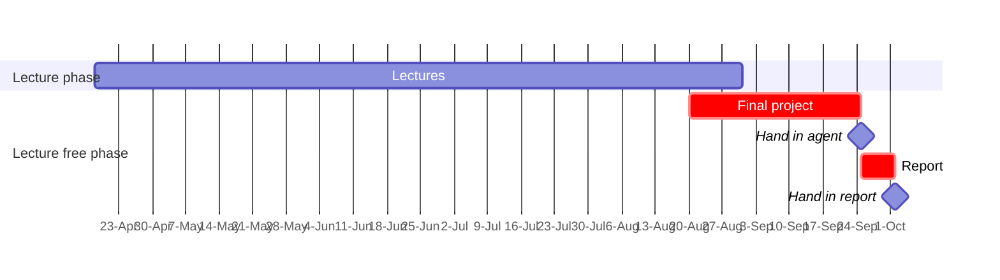

# Machine Learning Essentials
> Summer semester 2023  
> Heidelberg University  
> Prof. Dr. Ulrich Köthe  
> Heidelberg Collaboratory for Image Processing (HCI)

Heidelberg University's "Machine learning essentials" course lectured by Prof. Ulrich Köthe attempts to cover all the essential ML methods from linear classifiers and robust regression to neural networks and reinforcement learning.

## Timeplan

## Syllabus
-   Intro (learning from data, features and response, one-hot encoding, supervised/unsupervised/weakly supervised learning, notation, centered data)
-   Simple classifiers (threshold, perceptron & linear decision boundary, nearest neighbor - Voronoi decision boundary)
-   Evaluation (training vs test set, cross validation, confusion matrix, error rate, false positive/negative rate, precision/recall, AOC)
-   Bayes theorem (prior, likelihood, posterior), generative and discriminative classifiers
-   QDA, LDA (clustered data, multi-variate Gaussian distribution, co-variance matrix, precision matrix, generative model, maximum-likelihood estimation, i.i.d.)
-   SVM, LR, unification via loss functions
-   Non-linear classification: nearest neighbor and QDA recap, strategies: non-linear boundaries vs. augmented features, decision trees and forests, hand-crafted mappings
-   Neural networks: hand-crafted example, neurons, layers, architecture, activation functions, loss functions
-   Backprop, training tricks
-   Convolution, ConvNets
-   Famous CNNs and ResNets
-   U-nets and semantic segmentation
-   Ordinary least squares (normal equarions, pseudo-inverse, Cholesky, QR, singular value decomposition, LSQR)
-   Weighted LSQ, Heteroscedastic loss, alternating optimization, IRLS
-   Bias-variance trade-off, ridge regression, LASSO, orthogonal matching pursuit
-   Non-linear regression: non-linear LSQ (short), regression trees/forests, regression neural networks
-   Gaussian processes
-   GP kernels, Bayesian hyper-parameter optimization
-   Robust regression: robust loss functions (median, Huber, logcosh), RANSAC algorithm
-   Linear dimension reduction: PCA, ICA, NMF
-   Non-linear dimension reduction: LLE, t-SNE, UMAP
-   Non-linear dimension reduction: (variational) auto-encoders
-   Generative modelling: GANs, normalizing flows
-   Clustering: hierarchical, k-means, k-means++, k-medoids, GMM, EM algorithm
-   Reinforcement learning, Model-free RF, Deep Q-Learning
