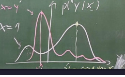

# Lecture 01: Introduction

Topics covered
- [x] learning from data
- [x] features and response
- [x] one-hot encoding
- [x] supervised/unsupervised/weakly supervised learning
- [x] notation
- [x] centered data

## What is ML?

Setting, we've got:
  - **Response variable**: Quantities $Y$ we would like to know, but cannot easily measure 
  - **Features**: Quantities $X$ we can measure and are related to $Y$

Idea:
  - learn a function $\hat{Y} = f(x)$ such that $\hat{Y}_i \approx Y^\ast*_i$
  - $Y^\ast*_i = truth$

Traditional science would proceed to ask an expert to model and design $f(x)$. However, in machine learning a more univeral approach is taken to learn a "universal function family".
- Chose a function family $\mathcal{F}$
- $\mathcal{F}$ has parameters $\theta$

Adjusting the paramters $\theta$ of a function family $\mathcal{F}$ one can optimize the model $\hat{Y^i}$
- Find $\hat{\theta}$ that fit the data best
  - $\hat{Y} = f_\hat{\theta}(x)$ so that $\hat{Y}_i \approx Y^\ast*_i$
- Example:
  - Set of all polynomials
  $$\mathcal{F} = \\{ax^2 + bx + c\\}$$
  $$\theta = [a, b, c]$$
  
  
  
 ## Basic machine learnign workflow
 
 1. Collect the data  
     1. Training dataset (TS): used to find and tune $\theta$
     2. Test dataset: used to validate the quality of the model
 2. Select the function family $\mathcal{F}$
    - Based on experience, prior-knowledge and trial-and-error
    - There are certain tools for this task
 3. Find the best $\hat{\theta}$ by fitting the $\mathcal{F}$ to the TS
 4. Validate the quality of $f_\theta(x)$ on the test set
 5. Deploy the model in practice

Separate training and test sets necessary to recognize **overfitting**  
- Overfitting: model is too good to be true

> THM1: Two sets of data must be collected: the training and test data.

## Probabilistic prediction

Reality is often more complicated. There is no unique true response $Y^\ast_i$. Instead there are a set of possible values $\\{ y^\ast_1, y^\ast_2, ... \\}$. E.g. $y^\ast \in [1,2,3]$. Hence, probabilistic predictions are made.

- Learn a conditional probability instead of a deterministic function
$$\hat{Y} \sim p(Y|X)$$

- ...
  - Probability of Y given X
  - X determines Y probability distribution
  - For every X we have a different distribution
  - ~: A sample is drawn from...
- Define a "universal probability family"  with paramteres $\theta$
- Choose $\theta$ such that $Y \sim P_\theta(Y|X)$ matches the data

- Strict generalization: deterministic case is recovered by definining: $$P_\theta(Y|X) = \delta(Y - f_\theta(x))$$

- ...
    - Delta function $\delta$ a single value from the distribution
    - AKA a single value probability distribution
    - Often
    
 Often we derive deterministic results from probabilistic predictions.  
 E.g.:
 - Mode of distribution = value with highest probability (via argmax $p(Y|x=1)$)
 - Mean
 - Median
 - Random
 
 ## Why is probabilitic prediction important?
 
 Reality is full of uncertainty on 4 levels:
 1. Fundamental: nature is not fully predictable
    - Quantum physics
    - Deterministic chaos
    - Combinatorial explosion
 2. Data
    - Finite
    - Noisy
    - Incomplete
    - Ambiguous: depending on the setting, the truth is different (addressed by probabilistic modelling).
 3. Model
     - Solutions $f_\hat{\theta}$, $P_\hat{\theta}$ are imperfect.
     - Function family too small
     - May not have converged perfectl
     - Nature has changed in the meantime
 4. Goal
     - Disagreement about what is relevant/desirable

> THM 2: Handling uncertainty is a central challenge of AI and ML.

## Notation

**Features**
- Row vector $X_i$ for each instance i (i = 1, ..., N)
- Features j (j = 1, ..., D)

**Feature matrix X**
- Rows: instances
- Columns: features
- $X \in \mathbb{R}^{N\times D}$
  
 |     | 1 (name) | 2 (height | 3 (gender) |
 | --- | -------- | --------- | ---------- |
 | 1   | Alice    | 1.7 m     | f          |
 | 2   | Bob      | 1.8 m     | m          |
 | N=3 | Max      | 1.9 m     | m          |
 
 - In python, all numbers = float, discrete labels = one-hot encoded
 
 |     | 1 (height) | 2 (f) | 3 (m) |
 | --- | ---------- | ----- | ----- |
 | 1   | 1.7        | 1     | 0     |
 | 2   | 1.8        | 0     | 1     |
 | 3   | 1.9        | 0     | 1     |
 
 - Individual cell elements $X_{ij}$

**Response**
- Row vector $Y_i$ for instance i
- Response elements $m(1, ..., M)$
- Mostly `M = 1`, scalar response
  - Exception: one-hot encoded response of discrete labels
- Tasks according to type of response
    1. $Y_i \in \mathbb{R}^M$ --> Regression $Y \approx f_\theta(X)$
    2. $Y_i$ discrete label $Y_i=k, k \in \\{1, ..., C\\}$
        - Ordinal: labels are ordered
        - Categorical: labels are unordered

## Types of learning approaches

1. **Supervised learning**
    - True responses are known in TS
 $$TS = \\{(X_i, Y_i)\\}^N_{i=1}$$
2. **Unsupervised learning**
    - Only features are known in TS
    $$TS = \\{(X_i)\\}^N_{i=1}$$
    - Learning algorithm needs to find structure in the data on its own ("data mining", "reasearch")
    - Few solutions that are guaranteed to work:
      - Representation learning: compute better features
        - $\tilde{X} = \varphi(X)$
        - E.g. dimensionality reduction (dim($\tilde{X}$ < dim(X))
      - Clustering: group similar instances into "clusters"
3. **Weakly supervised learning**
    - In between the previous two
    - Option 1: Some information about $Y_i$
      - E.g. know wn $Y_i$ for some instances, coarse labels "tumour in CT but don't know where
    - Option 2: Self-supervised learning. Define auxiliary tasks where $Y_i$ are easy to determine
      - E.g. large language models drop words from text
